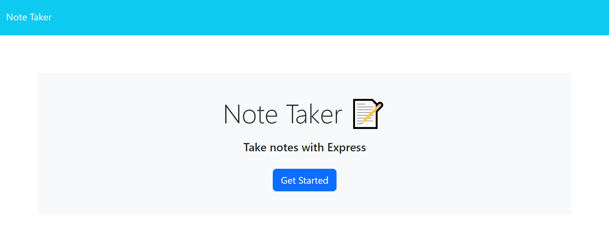
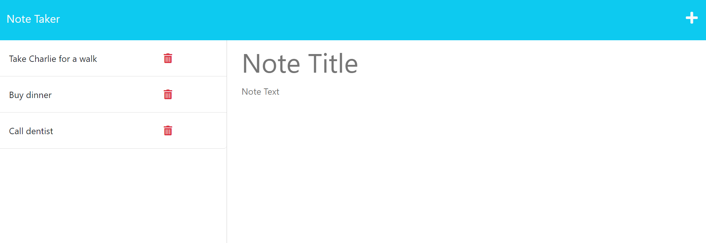

# Note Taker 

## Description
Note Taker project is a web application that allows users to easily save, view and/or delete notes so they can keep track of tasks they need to complete.\
This project is part of a challenge from Full Stack Coding Bootcamp at the University of Minnesota.

## Installation

For this application, if you wish to use the command line to review the code, please use https://nodejs.org/en/ to install Node.js (version 16 is recommended). All other necessary libraries are already installed (Express.js and UUID).

## Usage
To add, view and/or delete notes, from the main page:
1. Click on "Get Started".
1. To add a new note, add a title on "Note Title" and a short description on "Note Text".
1. When information is entered on "Note Title" and "Note Text", a Save icon will show on the top right corner of the page, next to the plus sign.
1. Click the save icon to save the note (if you do not wish to save the note, delete the information or simply click on the plus sign on the top right corner of the page).
1. Saved notes will be shown on the left side of the page.
1. Click on a saved note title to open it on the right/middle side of the page and view the short description.
1. Click on the plus sign on the top right corner to add a new note.
1. Click on the trash icon next to the saved note title to delete it.
1. Click on "Note Taker" on top left corner to go back to main page.

## Credits

N/A

## License

The license for this project is **The MIT License** 
To learn more about this license, please access https://opensource.org/licenses/MIT

## Link to deployed application

## Website preview

<kbd></kbd>
<kbd></kbd>

## Questions
  Visit my GitHub profile page: https://github.com/BiaJorgensen 
  If you have additional questions, please send an email to souzabeatriz17@gmail.com